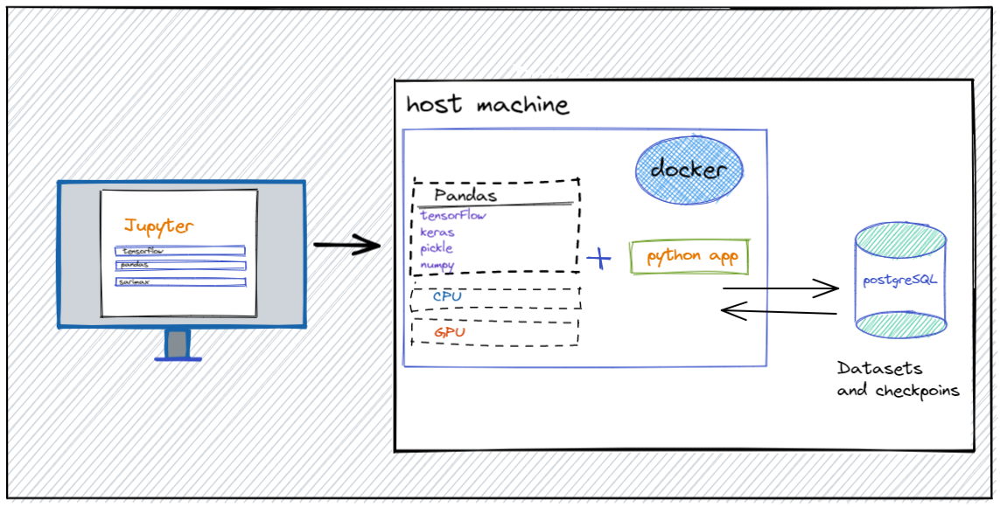

# Docker Container for your Machine Learning Model Example

A machine learning model can be run consistently across different environments, without worrying about missing dependencies or library conflicts using docker containers.
Machine learning model written in python using different libraries, will certainly need to interact with other applications 
written in other programming languages, for example, displaying a prediction result on front-end.
Docker is one way to manage all these interactions. Here's a general outline of the steps involved:


1. Write your machine learning model in Python.
2. Write a Dockerfile to specify the environment required to run the model, including the necessary libraries and dependencies.
3. Build the Docker image using the Dockerfile.
4. Start a container from the Docker image and run the Python script containing your machine learning model.

In this example, I have considered one of the ways to predict currency rates using the time series algorithm SARIMA.

Here's a general outline of the steps involved:

1. Collect historical currency exchange rate data.
2. Preprocess the data, such as handling missing values, normalizing the values, and transforming the data into a format suitable for training a machine learning model.
3. Split the data into training and testing sets.
4. Train a machine learning model on the training data. 
5. Evaluate the model on the testing data and make adjustments if necessary.
6. Use the final model to make predictions on future currency exchange rates.

Note that currency exchange rate prediction is a complex problem and there are many factors that can impact the exchange rates, 
such as economic conditions, political events, and market sentiment. 

## Getting Started

**Installation via `requirements.txt`**:
```shell

$ pip3 install -r requirements.txt    
$ python3 main.py
```
**Installation via [Pandas](https://pandas.pydata.org/docs/getting_started/install.html)**:
```shell
$ git clone https://github.com/asubay/forecast_example.git
$ cd forecast_example
$ pipenv shell
$ pipenv update
$ python3 main.py 
```
**Installation via [WSL](https://learn.microsoft.com/en-us/windows/wsl/install-manual)**:

## Usage

Replace the values in **.env.example** with your values and rename this file to **.env**:

* `DATABASE_USERNAME`: The username used to connect to your Postgres database.
* `DATABASE_PASSWORD`: Password for the above user.
* `DATABASE_HOST`: The hostname of your database (ie: localhost).
* `DATABASE_NAME`: The name of your "database" (the database inside your database - why isn't there a better term for this?).
* `DATABASE_PORT`: Port of your Postgres database (default is 5432).

*Remember never to commit secrets saved in .env files to Github.*

